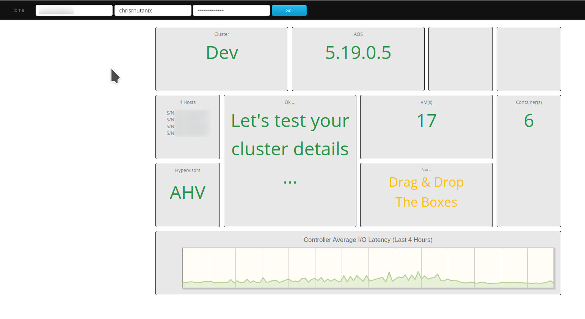

Testing The App
+++++++++++++++

With our JavaScript, AJAX, CSS, views and templates now in place, it's a good time to run our application and check that all components have been correctly "wired" together.

If you don't currently have your virtual environment activated or if the Python Flask application isn't running, these are the steps to do so.  Make sure you are in the **lab root** directory before running these commands.

.. figure:: images/linux_logo_32x32.png
.. figure:: images/osx_logo_32x32.png

.. code-block:: bash

   . nutanix/bin/activate
   flask run --host 0.0.0.0

.. figure:: images/windows_logo_32x32.png

.. code-block:: bash

   nutanix\Scripts\activate.bat
   flask run

**Quick question**.  Why don't we need to specify the name of our app and instruct Flask to treat our environment as non-production?  Correct - these settings are specified in the file named `.flaskenv`.

- Browse to http://127.0.0.1:5000 on your local machine to view your application.
- If everything is setup correctly, you will see a basic HTML form prompting for a **Prism Central IP**, your **Prism Central Username** and **Prism Central Password**.

You'll also see a number of styled and labelled "containers", ready for our Prism Central environment information to be displayed.

Fill out the following fields:

- **Prism Central IP** - The IP address of your Prism Central instance
- **Prism Central Username** - Prism Central username.  Note that this can be a read-only account, since we aren't making any changes.
- **Prism Central Password** - Prism Central password.

- Click **Go!**

If everything has been created and all parts of the application wired up correctly, the application will carry out our Prism Central v3 REST API requests via AJAX, process the results and display it all nicely on our page.

A successful test run will look similar to the screenshot below, although your Prism Central details will be different.

